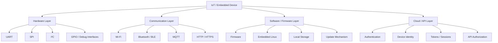
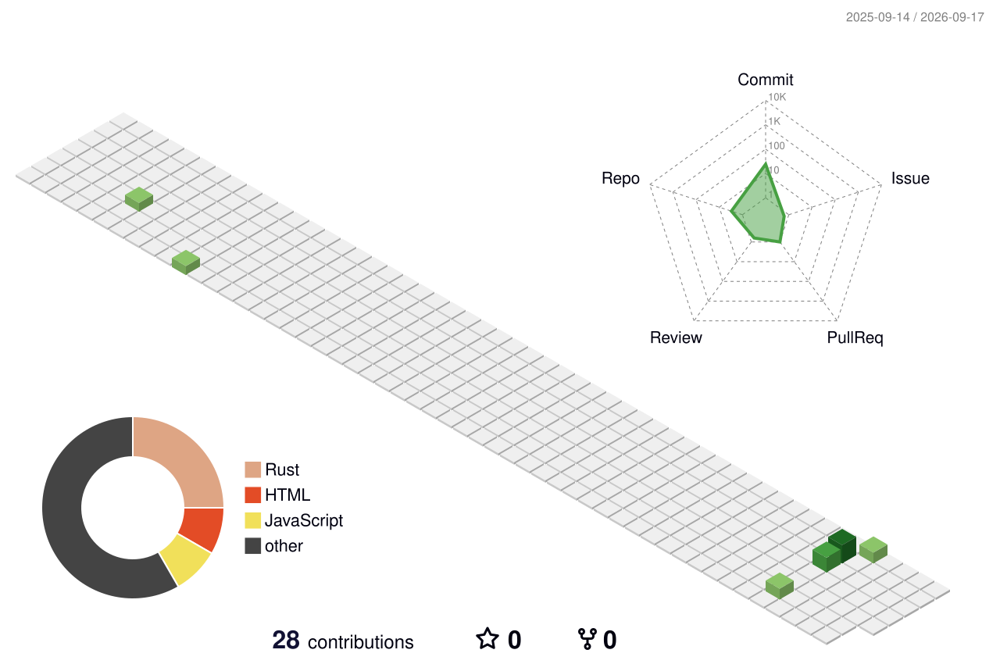

<!--
  ARUN K — GitHub Profile
  Ethical Hacker • Cybersecurity Researcher • IoT Penetration Tester
-->

<div align="center">



<br/>


<br/>

<a href="https://github.com/Arun-k-03">
  
</a>
<a href="https://www.linkedin.com/in/arun3826">
  
</a>
<a href="mailto:aruneh3826@gmail.com">
  
</a>

<br/><br/>


</div>

---

## `01 // WHOAMI`

```text
arun@security-research:~$ whoami

Name       : Arun K
Identity   : Ethical Hacker
Research   : Cybersecurity Research
Specialty  : IoT Penetration Testing
Focus      : Offensive Security • IoT • Web/API • Network • Hardware
Approach   : Analyze → Test → Understand → Secure → Document
```

I am building my cybersecurity portfolio around **real labs, reproducible experiments, security tooling, technical documentation, and responsible research**.

My goal is not to claim that I know everything. My goal is to show **how I investigate security problems, build controlled environments, validate findings, and improve defenses**.

---

## `02 // RESEARCH MATRIX`

<table>
<tr>
<td width="25%" valign="top">

### ⚔️ Offensive Security

- Web application testing
- API security
- Reconnaissance
- Attack-surface mapping
- Vulnerability assessment
- Authentication testing
- Network testing

</td>
<td width="25%" valign="top">

### 📡 IoT Security

- IoT attack surfaces
- ESP32 security
- MQTT
- BLE
- Embedded networking
- Firmware analysis
- Device-to-cloud security

</td>
<td width="25%" valign="top">

### ⚙️ Hardware Security

- UART
- SPI
- I²C
- GPIO
- Debug interfaces
- Embedded-device interfaces
- Hardware attack surfaces

</td>
<td width="25%" valign="top">

### 🔬 Research Engineering

- Python automation
- Security tooling
- Packet analysis
- Lab engineering
- Reproducibility
- Documentation
- Mitigation analysis

</td>
</tr>
</table>

---

## `03 // IoT ATTACK SURFACE`



I treat IoT security as a **full-stack security problem**: hardware, firmware, protocols, network traffic, local interfaces, APIs, authentication, cloud communication, and update mechanisms all matter.

---

## `04 // RESEARCH WORKFLOW`

```mermaid
flowchart LR
    A["Research Question"] --> B["Threat Model"]
    B --> C["Controlled Lab"]
    C --> D["Reconnaissance"]
    D --> E["Attack-Surface Analysis"]
    E --> F["Security Testing"]
    F --> G["Evidence"]
    G --> H["Root-Cause Analysis"]
    H --> I["Mitigation"]
    I --> J["Technical Documentation"]
```



```text
DEFINE
  ↓
MODEL
  ↓
BUILD LAB
  ↓
OBSERVE
  ↓
ENUMERATE
  ↓
TEST
  ↓
VALIDATE
  ↓
DOCUMENT
  ↓
MITIGATE
```

---

## `05 // CURRENT FOCUS`

### 📡 IoT & Embedded Security

```text
├── ESP32 security
├── MQTT security
├── BLE attack-surface analysis
├── UART / hardware interfaces
├── Firmware analysis
├── Embedded networking
└── Device-to-cloud communication
```

### 🌐 Web & API Security

```text
├── Authentication
├── Authorization
├── Input validation
├── API attack surfaces
├── Session security
├── Security misconfiguration
└── OWASP-oriented testing
```

### 🌐 Network Security

```text
├── Reconnaissance
├── Service enumeration
├── Packet analysis
├── Protocol inspection
├── Network traffic analysis
└── Controlled penetration-testing labs
```

### 🤖 AI-Assisted Security Engineering

```text
├── Security workflow automation
├── Log / data analysis
├── Threat-data processing
├── Security research assistance
└── Security-tool augmentation
```

---

## `06 // SECURITY TOOLCHAIN`

<div align="center">

### Offensive Security


### IoT / Embedded


### Programming / Engineering


</div>

---

## `07 // FEATURED WORK`

<table>
<tr>
<td width="100%" valign="top">

### 🛡️ AI-Powered Port Scanning & Phishing Detection Tool

A Python-based cybersecurity project combining network-port scanning with phishing-URL detection.

**Research / engineering areas**

`Python` `Network Security` `Port Scanning` `Phishing Detection` `Security Automation`

<a href="https://github.com/Arun-k-03/AI-powered-Port-Scanning-and-Phishing-Detection-Tool"><b>VIEW REPOSITORY →</b></a>

</td>
</tr>
</table>

### More repositories

<a href="https://github.com/Arun-k-03?tab=repositories">
  
</a>

---

## `08 // 3D CONTRIBUTION MATRIX`

<div align="center">

> The visualization below is generated automatically by GitHub Actions from real contribution activity.



</div>

---

## `09 // GITHUB TELEMETRY`

<div align="center">


<br/>


</div>

---

## `10 // RESEARCH REPOSITORY STANDARD`

Every serious security project I publish should aim to answer:

```text
Research Question
      ↓
Threat Model
      ↓
Lab Environment
      ↓
Methodology
      ↓
Observation
      ↓
Finding
      ↓
Impact
      ↓
Mitigation
      ↓
References
```

A strong security repository should contain **more than exploit code**. It should make the environment, assumptions, evidence, limitations, and defensive recommendations understandable.

---

## `11 // RESPONSIBLE SECURITY RESEARCH`

> [!IMPORTANT]
> Security testing, vulnerability research, proof-of-concept demonstrations, and penetration-testing material published through this profile are intended for **systems I own, intentionally vulnerable environments, CTFs, controlled laboratories, or systems where explicit authorization has been granted**.

My purpose is:

```text
SECURITY EDUCATION
        +
VULNERABILITY UNDERSTANDING
        +
REPRODUCIBLE RESEARCH
        +
DEFENSIVE IMPROVEMENT
        +
RESPONSIBLE DISCLOSURE
```

---

## `12 // RESEARCH PRINCIPLES`

```text
┌──────────────────────────────────────────────────────────┐
│                                                          │
│  UNDERSTAND THE SYSTEM                                   │
│             ↓                                            │
│  IDENTIFY THE ATTACK SURFACE                             │
│             ↓                                            │
│  TEST WITH AUTHORIZATION                                 │
│             ↓                                            │
│  COLLECT REPRODUCIBLE EVIDENCE                           │
│             ↓                                            │
│  UNDERSTAND THE ROOT CAUSE                               │
│             ↓                                            │
│  DOCUMENT THE FINDING                                    │
│             ↓                                            │
│  IMPROVE THE DEFENSE                                     │
│                                                          │
└──────────────────────────────────────────────────────────┘
```

---

## `13 // MISSION`

```console
arun@security-research:~$ cat mission.txt

[+] Study real security problems
[+] Build controlled research environments
[+] Develop useful security tooling
[+] Explore IoT and embedded attack surfaces
[+] Understand hardware, firmware and network security
[+] Document reproducible findings
[+] Improve defensive understanding
[+] Contribute useful cybersecurity research

arun@security-research:~$ _
```

---

<div align="center">

### `RESEARCH • BUILD • TEST • SECURE • DOCUMENT`

<br/>

**ARUN K**

`ETHICAL HACKER` • `CYBERSECURITY RESEARCHER` • `IoT PENETRATION TESTER`

<br/>

<a href="https://github.com/Arun-k-03">
  
</a>
<a href="https://www.linkedin.com/in/arun3826">
  
</a>
<a href="mailto:aruneh3826@gmail.com">
  
</a>

</div>

